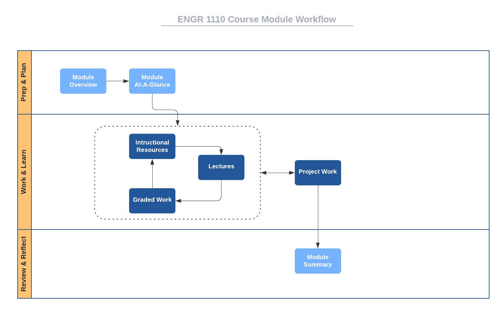

# Course Structure

This course is organized into 15 modules numbered
[zero](https://www.cs.utexas.edu/users/EWD/transcriptions/EWD08xx/EWD831.html)
through 14. Module 0 is mostly an introductory "getting started" module, while
Module 1 through Module 14 are full course-content modules. Rather than being
organized strictly by content, these modules are
[timeboxed](https://en.wikipedia.org/wiki/Timeboxing); that is, M1 -- M14 are of
fixed, equal durations with specific tasks to be completed within each. We will
become familiar with [agile
methods](https://en.wikipedia.org/wiki/Agile_software_development), as we go
through the course and you'll recognize similarities to
[Scrum](https://en.wikipedia.org/wiki/Scrum_(software_development)) sprints.

Scheduling, planning, and knowing when things are due are easily done with
timeboxed modules. All graded items are scheduled to be due or delivered on
module boundaries. Specifically, each graded item in the course is due by the
last day of the module that contains it or the last day of a later module as
specified by its due date. 

Here is the schedule for [the current semester](http://www.auburn.edu/main/auweb_calendar.php).

Module    | Dates                   | Duration 
------    | ----------------------- | -------- 
Module 00 | Mon 17 Aug - Sun 23 Aug | (7 days)
Module 01 | Mon 24 Aug - Sun 30 Aug | (7 days)  
Module 02 | Mon 31 Aug - Sun 06 Sep | (7 days)  
Module 03 | Mon 07 Sep - Sun 13 Sep | (7 days)^  
Module 04 | Mon 14 Sep - Sun 20 Sep | (7 days)  
Module 05 | Mon 21 Sep - Sun 27 Sep | (7 days)  
Module 06 | Mon 28 Sep - Sun 04 Oct | (7 days)  
Module 07 | Mon 05 Oct - Sun 11 Oct | (7 days)^  
Module 08 | Mon 12 Oct - Sun 18 Oct | (7 days)  
Module 09 | Mon 19 Oct - Sun 25 Oct | (7 days)  
Module 10 | Mon 26 Oct - Sun 01 Nov | (7 days)  
Module 11 | Mon 02 Nov - Sun 08 Nov | (7 days)  
Module 12 | Mon 09 Nov - Sun 15 Nov | (7 days)  
Module 13 | Mon 16 Nov - Sun 29 Nov | (14 days)^  
Module 14 | Mon 30 Nov - Fri 04 Dec | (5 days)  

^ *University No-Class Days:*  
Mon 07 Sep, Labor Day
Thu 08 Oct - Fri 09 Oct, Fall Break
Mon 23 Nov - Fri 27 Nov, Thanksgiving Break

# Module Structure

Each of the 14 content modules has the same structure with the following
components.

- **Module Overview:** A brief introduction to the module content.
- **Module At-A-Glance:** A more complete description of the module focus, tips
  for success, and learning objectives.
- **Instructional Resources:** Links to lecture notes for the module and
  references to associated readings from textbooks.
- **Graded Work:** Deliverables from the Activities, Labs, Project, and Reading,
  Response, & Reflection categories that must be turned in for a grade.
- **Summary:** A brief recap of what was covered in the module.

# Workflow

Since each content module has the same structure, you can apply the same process
to going through each. Here is a suggested
[workflow](https://en.wikipedia.org/wiki/Workflow) for going through each module
of this course.

Notice the iterative nature of the items in the *Work & Learn*
[swimlane](https://en.wikipedia.org/wiki/Swim_lane). Start each module when it
opens rather than putting things off, as it will likely take you the full time
to complete all the work.

